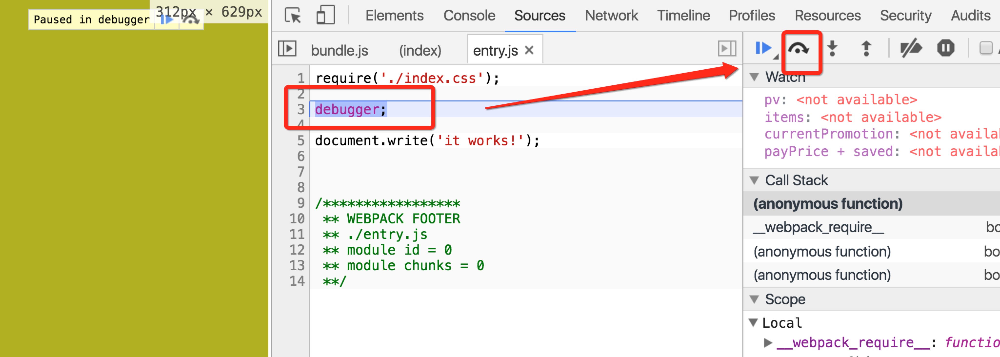

Webpack SourceMap Demo
======================

Generate source-map for the generated bundle.js which is friendly to development.

```
npm install -g webpack
npm install
webpack
```

Then open `index.html` in your browser, and open the dev tool of the browser, and refresh. You will see the break point and the clear source code.

